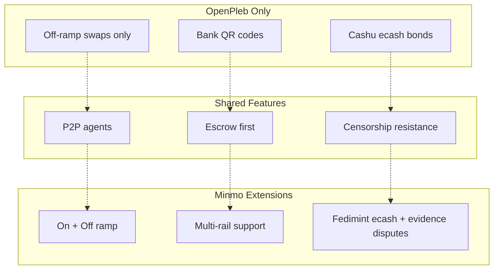

# Comparison with OpenPleb

This document highlights the intersections and differences between **Minmo** and **OpenPleb**.  
The goal is to identify areas of shared values and potential collaboration, while clarifying Minmo’s broader scope.

---

## Shared Values

Both projects are built on the principle of **censorship-resistant, peer-to-peer swaps**:
- Open-source ethos: code and standards open to the community.  
- Agents, not institutions, are the core liquidity providers.  
- Fiat Channels are used directly, without centralized custodians.
- Escrow ensures Bitcoin is only released when fiat obligations are met.  

---

## Key Differences

| Aspect                   | OpenPleb                           | Minmo |
|---------------------------|-------------------------------------|-------|
| Swap direction            | Off-ramp only (BTC → Fiat)         | Both on-ramp (Fiat → BTC) and off-ramp (BTC → Fiat) |
| Fiat Channels supported   | Bank QR codes only                 | Multiple: QR codes, mobile money, bank transfers, etc. |
| Escrow mechanism          | Bonds via ecash tokens (Cashu)     | Fedimint ecash escrow with time-locked auto-release + evidence scoring |
| Dispute coverage          | Payment disputes                   | Payment, unresponsiveness, partial payments, invalid details |
| Resolution transparency   | Early-stage, in development        | Defined rules + audit trail |
| Target use case           | Local, peer off-ramps              | Global agent exchange infra, embedded into apps |
| Status                    | Active development, prototype      | Production-focused design with multi-rail support |

---

## Intersections for Partnership

1. **Escrow Standards**  
   - Both systems use escrow as the foundation.  
   - Potential to align on dispute resolution APIs or escrow state machine definitions.  

2. **Dispute Handling**  
   - OpenPleb: focuses on **payment disputes**.  
   - Minmo: expands coverage (timeouts, partials, invalid details).  
   - Intersection: Minmo's Fedimint-based evidence + timeout model could complement OpenPleb's Cashu bond system.  

3. **Payment Methods**  
   - OpenPleb: QR banking rails.  
   - Minmo: adds mobile money and other rails.  
   - Intersection: OpenPleb agents could benefit from broader fiat support by adopting Minmo standards.  

4. **Agent Networks**  
   - Both empower community agents.  
   - Shared reputation and discovery mechanisms could reduce fragmentation.  

---

## Diagram: Overlap vs Extension

---

## Summary

- **OpenPleb** pioneered an open-source, QR-based off-ramp model.  
- **Minmo** extends this model into a **broader ecosystem** with more swap types, more fiat methods, and deeper dispute coverage.  
- Instead of competing, there is an opportunity to **standardize escrow/dispute flows** so liquidity and agents can interoperate across both systems.  

This alignment could help both projects grow faster while keeping the ecosystem open and censorship-resistant.
