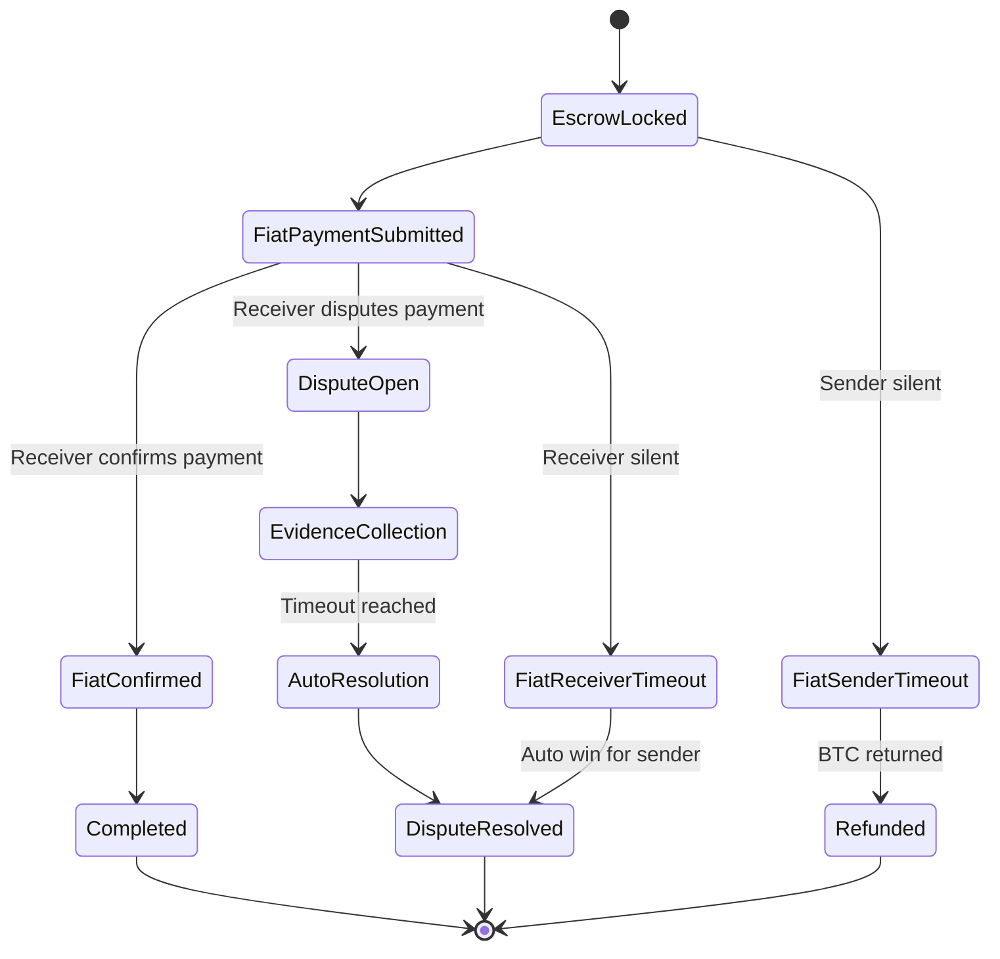
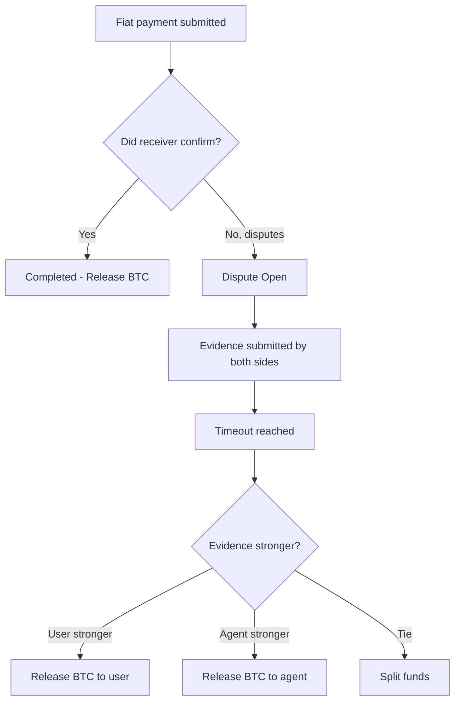

# Dispute Flows

This document describes how Minmo handles disputes in both **on-ramp (fiat → BTC)** and **off-ramp (BTC → fiat)** swaps.  
Disputes arise when one party claims they have acted correctly while the other disagrees or fails to respond.

The system is designed to be:
- **Automatic**: most disputes resolve via timeouts and rules.  
- **Evidence-based**: both sides can submit proof.  
- **Time-limited**: funds cannot remain locked indefinitely.  

---

## Types of Disputes

### 1. Payment Dispute
- **Scenario**: One side claims to have made payment, the other denies it.  
- **Resolution**: Both sides submit evidence → system scores it → funds released accordingly.  

### 2. Fiat Party Unresponsiveness
- **Scenario**:  
  - User does not send fiat after instructions (fiat sender timeout).  
  - Agent does not confirm after receiving fiat (fiat receiver timeout).  
- **Resolution**: Timeout triggers automatic release in favor of the responsive party.  

### 3. Partial Payment
- **Scenario**: Fiat amount received is less than agreed.  
- **Resolution**: Funds split proportionally or returned, depending on evidence.  

### 4. Invalid Payment Details
- **Scenario**: Wrong account number, QR, or payment info provided.  
- **Resolution**: Automatic refund to original sender.  

---

## Dispute Lifecycle

---

## Evidence Collection

### Evidence Types
- **Transaction ID / Reference Number**  
- **Bank or mobile money statement**  
- **Screenshots of successful payment**  
- **Timestamps of transfer attempts**  

### Evidence Weighting
| Evidence Type        | Weight | Reliability |
|----------------------|--------|-------------|
| Transaction ID       | 0.4    | High        |
| Account Statement    | 0.3    | High        |
| Screenshot           | 0.2    | Medium      |
| Timestamp            | 0.1    | Low         |

The system sums up the scores for each side.  
- If one side leads by a margin → they win.  
- If scores are close → split outcome.  

---

## Example: Payment Dispute Flow

---

## Resolution Outcomes

- **User Wins**: BTC released/refunded to user.  
- **Agent Wins**: BTC released to agent.  
- **Split**: BTC divided equally between parties.  
- **Refund**: BTC returned to sender if invalid payment details or sender timeout.  

---

## Intersection with OpenPleb

| Aspect                  | OpenPleb                   | Minmo |
|--------------------------|----------------------------|-------|
| Dispute coverage         | Mainly payment disputes    | Payment, unresponsiveness, partial, invalid details |
| Escrow resolution method | Bonds with Cashu tokens    | Timeouts + evidence-based scoring |
| Fiat rails considered    | Bank QR codes              | Multiple (QR, bank transfer, mobile money) |
| Resolution transparency  | Still in development       | Defined audit trail + scoring rules |

---

## Summary

- Disputes are limited in scope, automated where possible, and fair by design.  
- Multiple dispute types ensure coverage for real-world fiat risks.  
- Evidence-based scoring balances fairness with automation.  
- Minmo extends beyond OpenPleb by handling **more dispute scenarios** and **supporting more fiat payment methods**.  
