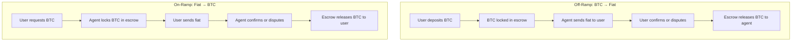

# Overview

Escrow and dispute resolution are critical to making agent-based Bitcoin swaps safe and fair.  
Without these systems, users risk losing funds whenever fiat moves outside the protocol.

Minmo’s approach extends existing community efforts (like OpenPleb) by covering:
- **Both on-ramp and off-ramp flows**
- **Multiple fiat payment methods** (QR codes, mobile money, bank transfers, others)
- **Evidence-based dispute resolution** with clear, automated rules
- **Time-locked auto-release** so no funds can ever remain locked indefinitely

---

## Why Escrow Matters

In every swap, one side sends **Bitcoin** and the other sends **fiat**.  
The challenge: fiat payments happen outside the blockchain, so the protocol cannot verify them directly.

Escrow ensures:
1. **Funds are locked** until both sides fulfill their obligations.
2. **Disputes are possible** if one side claims the other hasn’t acted.
3. **Fair resolution** via timeouts and evidence ensures neither party is left hanging.

---

## Core Principles

1. **Fairness** – Decisions rely on evidence, not admin intervention.
2. **Transparency** – Every resolution has an audit trail and reason.
3. **Automation** – Manual arbitration is minimized; timeouts resolve most disputes.
4. **Safety** – Funds can’t be lost or locked forever.
5. **Flexibility** – Works across different fiat rails (QR codes, mobile money, bank transfers).
6. **Interoperability** – Open design that can interconnect with projects like OpenPleb.

---

## Escrow Lifecycle at a Glance

---

## Shared Vision with OpenPleb

Both Minmo and OpenPleb are built on the principle of **censorship-resistant, peer-to-peer swaps**.  
Where we extend their model is in:
- Handling **both swap directions** (they currently handle only off-ramps).
- Covering **more fiat payment types** (they focus on QR banking codes).
- Defining **broader dispute coverage** (unresponsiveness, partial payments, invalid details).

This creates an opportunity for **interoperability**: aligning our escrow and dispute logic so agents and users can operate across both platforms.
