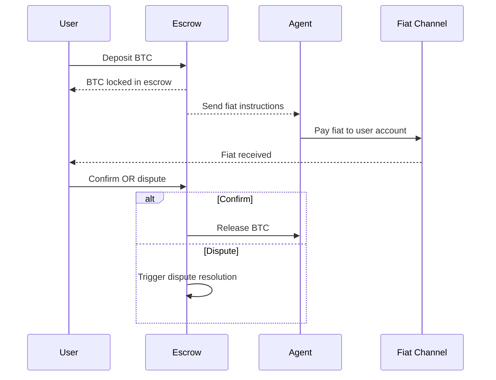
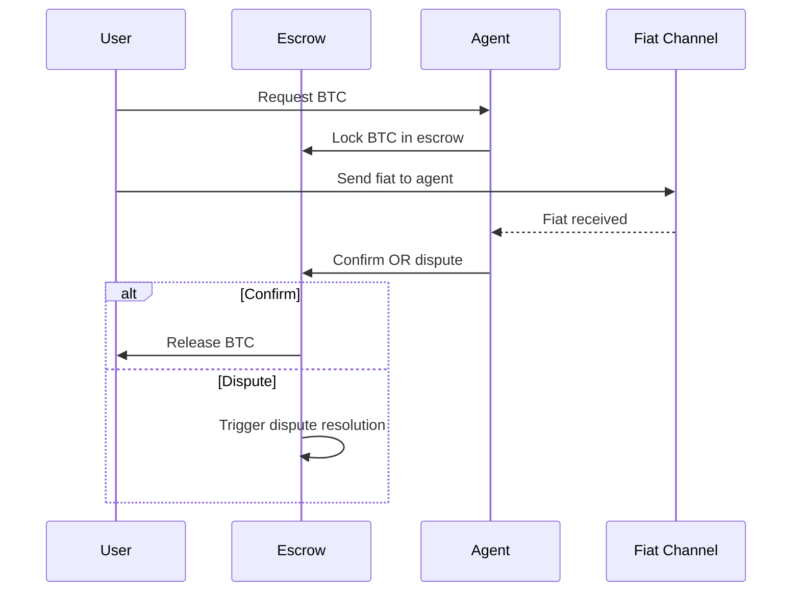
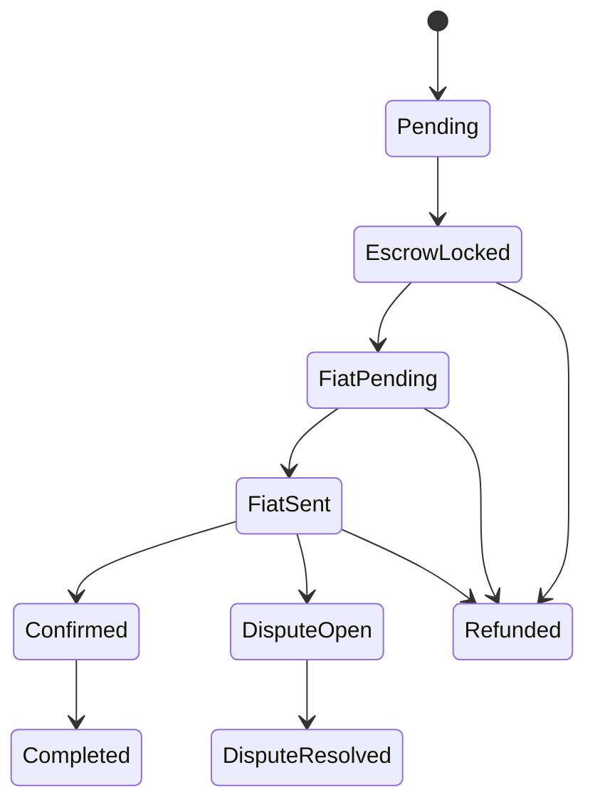

# Escrow Flows

This document describes how Minmo manages escrow lifecycles for both **on-ramp** (fiat → BTC) and **off-ramp** (BTC → fiat) swaps.  
Escrow is the backbone of trust in the system, using **Fedimint ecash** to ensure no funds are released until obligations are fulfilled or disputes are resolved.

---

## Escrow Lifecycle Principles

1. **Lock First** – Bitcoin is always locked in Fedimint ecash escrow before fiat is sent.  
2. **Timeouts Everywhere** – Each stage has a time limit, preventing funds from being stuck forever.  
3. **Dispute Entry Points** – At key stages, either party can raise a dispute if they believe the other side has not acted correctly.  
4. **Automatic Resolution** – Timeouts and evidence rules decide most cases without manual arbitration.  

---

## Off-Ramp Flow (BTC → Fiat)

### Step-by-Step

1. **User deposits BTC** into Fedimint ecash escrow.  
2. **Agent receives fiat payment instructions** from user.  
3. **Agent sends fiat** to user's account (bank QR, mobile money, etc.).  
4. **User confirms receipt** (or raises a dispute).  
5. **Fedimint ecash escrow releases BTC** to the agent once confirmed or dispute resolved.  

---

## On-Ramp Flow (Fiat → BTC)

### Step-by-Step

1. **User requests BTC** at agreed rate.  
2. **Agent locks BTC** into Fedimint ecash escrow.  
3. **User sends fiat** via chosen method (bank transfer, QR code, mobile money).  
4. **Agent confirms receipt** (or raises dispute).  
5. **Fedimint ecash escrow releases BTC** to the user.  

---

## Key Differences vs. OpenPleb

| Aspect             | OpenPleb                    | Minmo |
|--------------------|-----------------------------|-------|
| Swap direction     | Off-ramp only (BTC → Fiat)  | Both on-ramp & off-ramp |
| Fiat payment type  | Bank QR codes               | QR codes, mobile money, bank transfers, others |
| Escrow trigger     | Always user BTC deposit     | Fedimint ecash: BTC deposit (off-ramp) OR agent BTC lock (on-ramp) |
| Lifecycle coverage | Partial (under development) | Full, with timeouts and disputes |

---

## Escrow States

To track each stage clearly, Minmo defines a set of **escrow states**:

- **Pending** – swap initiated, escrow not yet locked.  
- **EscrowLocked** – BTC secured in Fedimint ecash escrow.  
- **FiatPending** – fiat payment instructions shared.  
- **FiatSent** – fiat payment submitted, awaiting confirmation.  
- **Confirmed** – fiat confirmed by receiver.  
- **Completed** – swap finished, BTC released.  
- **DisputeOpen** – dispute raised, evidence collection in progress.  
- **DisputeResolved** – funds released after auto-resolution or timeout.  
- **Refunded** – funds returned to original party after timeout or invalid details.  

---

## Summary

- Fedimint ecash escrow guarantees fairness by locking BTC before fiat moves.  
- Both **on-ramp and off-ramp flows** are supported.  
- Multiple fiat payment types are covered, making Minmo flexible in global south contexts.  
- States and timeouts prevent indefinite locks.  
- OpenPleb and Minmo share similar values, but Minmo expands the scope to cover more flows and payment types.
